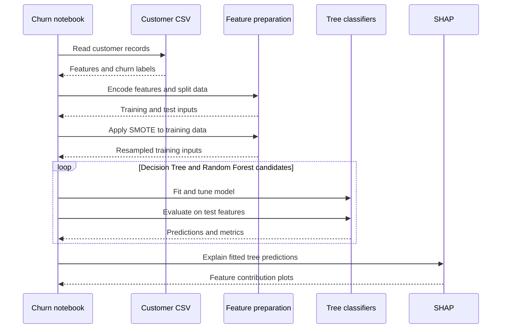

# Banking Customer Churn Analysis

A notebook exploring banking customer attrition and comparing explainable classification models for the churn target.

**Technology:** Python · pandas · scikit-learn · imbalanced-learn · SHAP

## Features

- Explore demographics, account attributes, and churn distributions.
- Prepare categorical features and use SMOTE on the training data.
- Tune Decision Tree and Random Forest classifiers with GridSearchCV.
- Inspect classification metrics, confusion matrices, ROC curves, and SHAP explanations.

## Repository guide

| Path | Purpose |
|---|---|
| [banking-churn-analysis-modeling.ipynb](banking-churn-analysis-modeling.ipynb) | EDA, preprocessing, model tuning, and explanation. |
| [Churn_Modelling (1).csv](Churn_Modelling%20%281%29.csv) | Committed banking churn dataset. |

## Requirements and current limitations

The notebook references `/kaggle/input/churn-modelling/Churn_Modelling.csv`. Update it to the included CSV, whose filename contains a space and `(1)`. Keep oversampling and model selection inside the training workflow when reproducing evaluation.

This repository is an analysis notebook, with no separate deployed churn service.

## UML diagrams

### Main workflow

The training branch applies SMOTE and compares tree models; SHAP provides a separate explanation step.



## Getting started

```bash
git clone https://github.com/IbrahimAbdelsattar/Customer-Churn-Analysis.git
cd Customer-Churn-Analysis
```

Use a Python virtual environment:

```bash
python -m venv .venv
```

Activate it with `source .venv/bin/activate` on macOS/Linux or `.venv\Scripts\Activate.ps1` in PowerShell.

```bash
python -m pip install jupyter pandas numpy matplotlib seaborn scipy scikit-learn imbalanced-learn shap
python -m jupyter notebook
```

Open the notebook listed above and run its cells in order. Adjust dataset and model paths as described in the limitations section.
