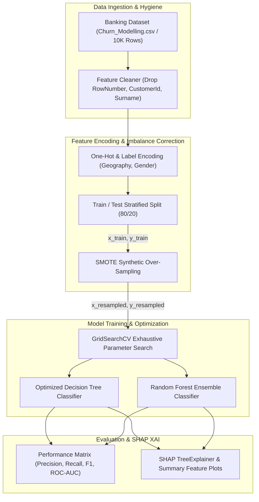

<br/><br/>

<!-- Animated Title -->
<p align="center">
  <a href="#">
    
  </a>
</p>

<p align="center">
  <b>Comprehensive Banking Customer Churn Analysis & Explainable AI (XAI) Predictive System</b><br/>
  <i>Synthetic Minority Over-Sampling (SMOTE) · Ensemble Classification · Hyperparameter Optimization · SHAP Attribution Dynamics · High-Fidelity EDA</i>
</p>

<br/>

<!-- Badges Row 1: Core Technologies -->
<p align="center">
  
  
  
  
  
</p>

<!-- Badges Row 2: Analytics & Standards -->
<p align="center">
  
  
  
  
  
</p>

<br/>

<!-- Quick Navigation Bar -->
<p align="center">
  <a href="#-overview"></a>
  &nbsp;
  <a href="#-problem-statement--banking-solution"></a>
  &nbsp;
  <a href="#-core-capabilities"></a>
  &nbsp;
  <a href="#%EF%B8%8F-analytical-architecture"></a>
  &nbsp;
  <a href="#-machine-learning--shap-xai-pipeline"></a>
  &nbsp;
  <a href="#-quickstart--execution"></a>
</p>

---

## 📌 Overview

**Customer Churn Analysis** is an end-to-end data science and machine learning investigation designed to identify, explain, and mitigate customer attrition in retail banking. Retaining existing depositors is mathematically proven to cost up to **5x to 7x less** than customer acquisition.

This study analyzes the benchmark **10,000-customer banking portfolio** (`Churn_Modelling.csv`). It resolves severe class imbalance through **Synthetic Minority Over-sampling (SMOTE)**, tunes tree-based ensembles (**Random Forest** & **Decision Trees**) via **GridSearchCV**, and deploys **SHAP (SHapley Additive exPlanations)** to unpack the black box—providing branch managers and retention marketing teams with actionable attribution insights into why individual customers close their accounts.

```
                      ┌────────────────────────────────────────────────────────┐
                      │              Customer Churn Analytics                  │
                      │                                                        │
[ 10K Banking Cohort ]──┼──> [ Preprocessing & One-Hot / Label Encoding ]       ├──> [ Actionable Retention ]
[ Balance, Age, Prod ]  │             │                                          │    - Churn Probability
                        │             ▼                                          │    - SHAP Feature Attribution
                        │    [ SMOTE Class Balancer ] ──> Balanced Space         │    - ROC-AUC / F1 Scores
                        │             │                                          │    - High-Risk Customer Segments
                        │             ▼                                          │
                        │    [ Tuned Random Forest / Decision Tree Ensemble ]    │
                        └────────────────────────────────────────────────────────┘
```

---

## 🎯 Problem Statement & Banking Solution

<table>
<tr>
<td width="50%" valign="top">

### ❌ The Banking Churn Crisis

Retail banking institutions face systematic silent attrition:

- 💸 **Asymmetric Acquisition Cost**: Winning a new depositor requires aggressive deposit bonuses and marketing costs.
- 🕳️ **Silent Defections**: Customers rarely announce intent to close accounts; balances gradually taper off before zeroing out.
- 📉 **Imbalanced Attrition Signals**: Only $\sim 20\%$ of customers churn in typical quarters, causing standard classification algorithms to ignore the minority churn class.
- 🔮 **Black-Box Skepticism**: Executive loan committees and branch managers reject AI risk scores unless backed by explainable demographic drivers.

</td>
<td width="50%" valign="top">

### ✅ The Analytical Solution

| Challenge | Applied Engineering Solution |
| :--- | :--- |
| **Imbalanced Records** | **SMOTE Over-Sampling** generates synthetic minority observations in feature space to balance class boundaries. |
| **Non-Linear Dynamics** | **Random Forest & Decision Trees** map complex multi-product interactions (e.g. `Age` vs `NumOfProducts`). |
| **Rigorous Hyperparameter Tuning** | **GridSearchCV** systematically explores criterion, tree depth, and split parameters. |
| **Explainable AI (XAI)** | **SHAP TreeExplainer** calculates exact Shapley values showing each feature's marginal push toward churn or retention. |
| **Holistic Statistical EDA** | In-depth distributions, correlation heatmaps, and demographic churn breakdowns. |

</td>
</tr>
</table>

---

## 🔥 Core Capabilities

<table>
<tr>
<td width="33%" align="center" valign="top">

### ⚖️ SMOTE Resampling
<br/>
<b>Minority Class Synthesis</b>
<p align="left">
• K-nearest neighbor interpolation<br/>
• Eradicates majority-class bias<br/>
• Preserves minority variance<br/>
• Prevents synthetic data leakage<br/>
• Applied strictly to training folds
</p>

</td>
<td width="33%" align="center" valign="top">

### 🌲 Tuned Ensembles
<br/>
<b>Random Forest & Decision Trees</b>
<p align="left">
• Automated GridSearchCV tuning<br/>
• Max depth & min samples split search<br/>
• Out-of-bag error validation<br/>
• Robust to outlier financial metrics<br/>
• Gini & Entropy split criteria
</p>

</td>
<td width="33%" align="center" valign="top">

### 🧠 SHAP Attribution
<br/>
<b>Game-Theoretic XAI</b>
<p align="left">
• TreeExplainer integration<br/>
• Global summary waterfall plots<br/>
• Individual customer force plots<br/>
• Identifies primary churn catalysts<br/>
• Uncovers product threshold traps
</p>

</td>
</tr>
</table>

---

## 🏗️ Analytical Architecture



---

## 🔬 Machine Learning & SHAP XAI Pipeline

### 1. Feature Representation
- **Demographics**: `Geography` (France, Spain, Germany), `Gender`, `Age`.
- **Financial Profile**: `CreditScore`, `Balance`, `EstimatedSalary`.
- **Engagement & Relationship**: `Tenure`, `NumOfProducts`, `HasCrCard`, `IsActiveMember`.
- **Target**: `Exited` (Binary: 0 = Retained, 1 = Churned).

### 2. Primary SHAP Findings
1. **Age**: Older customers ($\ge 50$) show exponentially higher churn vulnerability compared to younger cohorts.
2. **Number of Products**: Customers holding $1$ product or $>2$ products churn at significantly higher rates than those holding exactly $2$ products (the retention sweet spot).
3. **Active Membership**: `IsActiveMember` serves as the primary protective insulating factor against competitor recruitment.
4. **Geography**: German customers demonstrate higher attrition rates compared to French and Spanish counterparts, driven by regional banking competition.

---

## ⚙️ Technical Stack

| Component | Technology | Purpose & Implementation |
| :--- | :--- | :--- |
| **Language** | **Python 3.10+** | Analytical foundation |
| **Machine Learning** | **Scikit-Learn** | Tree models, encoders, train-test splits, metrics, and GridSearchCV |
| **Class Imbalance** | **Imbalanced-Learn (imblen)** | Synthetic Minority Over-sampling Technique (SMOTE) |
| **Explainable AI (XAI)** | **SHAP** | Game-theoretic feature attribution and summary visualization |
| **Data Manipulation** | **Pandas & NumPy** | In-memory data wrangling and matrix transformations |
| **Statistical Visuals** | **Seaborn & Matplotlib** | Distribution plotting, correlation matrices, and boxplots |

---

## 📁 Repository Structure

```
Customer-Churn-Analysis/
├── 📄 banking-churn-analysis-modeling.ipynb # Comprehensive 220-cell analysis & modeling notebook
├── 📊 Churn_Modelling (1).csv              # Benchmark dataset (10,000 banking customers)
└── 📄 README.md                            # Project documentation
```

---

## 🚀 Quickstart & Execution

### Prerequisites
- **Python**: 3.10 or higher
- **Jupyter Lab / Notebook**: Required to execute interactive cells

---

### 1. Installation

```bash
# 1. Clone repository
git clone https://github.com/IbrahimAbdelsattar/Customer-Churn-Analysis.git
cd Customer-Churn-Analysis

# 2. Create virtual environment
python -m venv venv
source venv/bin/activate        # On Windows: .\venv\Scripts\activate

# 3. Install required libraries
pip install numpy pandas scipy scikit-learn imbalanced-learn shap seaborn matplotlib jupyter
```

---

### 2. Running the Analytical Notebook

```bash
jupyter notebook banking-churn-analysis-modeling.ipynb
```

*Execute the notebook to reproduce all exploratory data analysis, SMOTE resampling, hyperparameter searches, and SHAP explainability charts.*

---

## 👥 Author & Connect

**Ibrahim Abdelsattar**  
*AI Engineer & Machine Learning Specialist*

- 🌐 **GitHub**: [@IbrahimAbdelsattar](https://github.com/IbrahimAbdelsattar)
- 💼 **LinkedIn**: [Ibrahim Abdelsattar](https://www.linkedin.com/in/ibrahim-abdelsattar/)
- 📧 **Email**: [ibrahimabdelsattar042@gmail.com](mailto:ibrahimabdelsattar042@gmail.com)

---

<p align="center">
  <sub>Engineered for financial analytics, retention optimization, and explainable AI. © 2026 Customer Churn Analysis.</sub>
</p>
